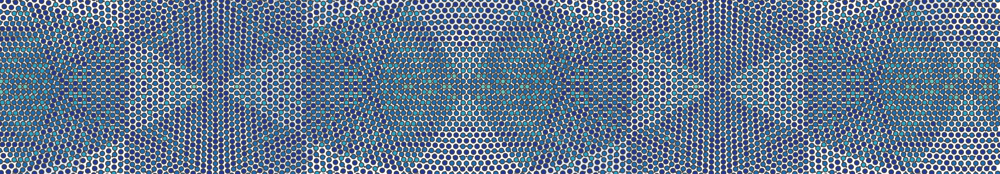
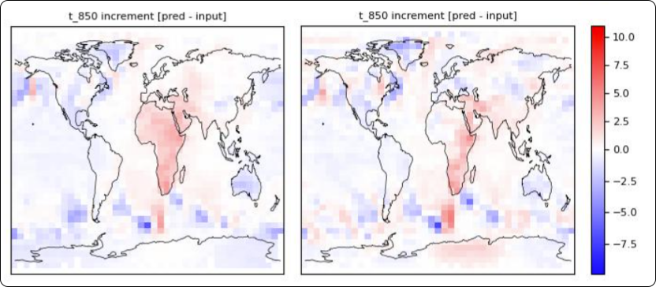

# Simple Anemoi training setup with default setting


*Disclaimer: This is just a toy example and has not been thoroughly tested.*

## Setup
There’s an `apptainer/` folder with a ready-to-use apptainer (formerly singularity) definition.

1. **Build the image**

   ```bash
   cd apptainer
   apptainer build --nv anemoi.sif anemoi.def
   ```

2. **Get a shell**

   ```bash
   apptainer shell --nv anemoi.sif
   ```

3. **Run anemoi stuff**

   ```bash
   anemoi-training train --config-name=example.yaml
   anemoi-graphs inspect ../graphs/duo_gpu_048.pt ../../assets/graph-vis/
   ```

## Dataset
**Name**: `era5-o48-2020-2021-6h-v1`  
**Description**: A toy ERA5 low-resolution demo, 6-hourly data for 2020–2021.  
**Download**: [era5-o48-2020-2021-6h-v1.zip](https://data.ecmwf.int/anemoi-datasets/era5-o48-2020-2021-6h-v1.zip)

## Results
**Figure**: Comparison of air temperature prediction at 850 hPa between epoch 0 and 1 (Selected because they had the same color scale in both epochs, track v_min/v_max across epochs?). Some improvement in North-Africa :) Some new problems at the south pole :(
